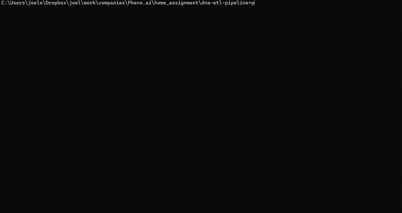

# ETL System for Genetic Data Processing

## Overview

This project implements an ETL (Extract, Transform, Load) system designed to process genetic data, specifically DNA sequences. The system is tailored to handle unstructured data from files and produce a structured, normalized JSON file for analysis. It supports two file types:

- **Txt files**: Containing DNA sequences.
- **JSON files**: Containing metadata about the DNA test.

The project ensures data accuracy and privacy by validating inputs, removing sensitive information, and performing required transformations.

---

## Features

1. **File Processing**:

   - Computes GC content and codon frequency for DNA sequences.
   - Identifies the most frequent codon across sequences.
   - Determines the Longest Common Subsequence (LCS) among DNA sequences.
   - Sanitizes JSON metadata by removing sensitive fields, validating lengths, and ensuring dates are within the specified range.

2. **ETL Workflow**:

   - **Extract**: Reads `.txt` and `.json` files, validates them, and extracts required data.
   - **Transform**: Processes files based on their type and applies specific transformations.
   - **Load**: Combines processed data into a single JSON file and saves it to the specified output directory.

3. **Flexible Interfaces**:

   - **GUI**: A user-friendly graphical interface built with `tkinter`.
   - **CLI**: A command-line interface for scriptable operations.

---

## Installation

### Prerequisites

- Python 3.8+
- Required packages (install via pip):
  ```bash
  pip install -r requirements.txt
  ```

### Folder Structure

```
project-root/
├── pipeline/
│   ├── extract.py
│   ├── transform.py
│   ├── load.py
│   └── processors/
│       ├── file_processor.py
│       ├── test_metadata_json_processor.py
│       └── dna_sequence_txt_processor.py
├── utils/
├──── input_validator.py
├── main.py
├── ui/
│      ├── gui/
│      │    └── gui.py
│      ├── cli/
│      │    └── cli.py
│      └── assets/
│           └── gifs/
├── tests/
│   ├── test_extract.py
│   ├── test_file_validation.py
│   ├── test_json_processor.py
│   ├── test_processor_factory.py
│   └── test_txt_processor
├── data/
│   └── inputs/
│           ├── invalid/
│               ├── 7a2bc928-9ea0-498e-80f1-3113da2b50a6_input.json
│               ├....
│               └── invalid_json_input.json
│           └── valid/
│               ├── 12ba71a0-30f4-464e-ba1b-9a31ea7d35fc_input.json
│               ├....
│               └── ffa093c9-c178-4631-9f0f-7be686d602b4_input.json
│       participants/
│           ├── 7a2bc928-9ea0-498e-80f1-3113da2b50a6/
│           ├....
│           └── ffa093c9-c178-4631-9f0f-7be686d602b4/
├──requirements.txt
└── README.md
```

---

## How to Use

### Running the Application

To use the system, you can choose between the GUI and CLI modes. Each interface is designed for a different user preference or operational need.

#### GUI Mode


To launch the graphical user interface, run the following command:
```bash
python main.py
```

When the GUI launches, it will prompt you to select a JSON file using a file selection dialog. The selected JSON must adhere to the valid input format described below. Once the file is selected, the ETL process will begin. If the process takes time, a "Processing..." window will appear to indicate ongoing operations. Upon completion, the system will display a message box indicating whether the process was successful or if an error occurred. This provides immediate feedback to the user.

#### CLI Mode



The command-line interface supports both single-file processing and batch processing of multiple JSON files. To use the CLI, run:
```bash
python main.py -i <input_file_or_directory>
```

- If an input file is specified, the system will process that file and output the result.
- If an input directory is specified, the system will process all valid JSON files in that directory. For each file processed, the CLI will display a line indicating the file being processed and the output result (e.g., "ETL process completed successfully for <filename>" or "Error: <description>"). This output provides clear visibility into the processing of each file.

### Input Format

The input JSON should contain the following structure:
```json
{
  "context_path": "<path_to_input_files>",
  "results_path": "<path_to_output_directory>/out/"
}
```
- `context_path`: Directory containing `.txt` and `.json` files.
- `results_path`: Directory where the output JSON will be saved.

Ensure that the input directory contains both `.txt` and `.json` files with matching UUIDs in their filenames.

### Output

The system generates a structured JSON file in the `results_path`. Example:
```json
{
  "metadata": {
    "start_at": "2025-01-18T12:00:00Z",
    "end_at": "2025-01-18T12:01:00Z",
    "context_path": "<input_directory>",
    "results_path": "<output_directory>/out/"
  },
  "results": [
    {
      "participant": {"_id": "<uuid>"},
      "txt": {"sequences": [...], "most_common_codon": "...", "lcs": {...}},
      "json": {"test_metadata": {...}, "analysis_metadata": {...}, "individual_metadata": {...}}
    }
  ]
}
```

---

## Development

### System Design and Architecture

The ETL system is designed using a modular architecture to ensure scalability, maintainability, and clarity. Each component has a specific role, enabling efficient processing and reducing interdependencies. Below is a detailed breakdown of the system's design:

---

### Core Components

#### Extractor:
- **Purpose**: Reads and validates input data, including file paths and UUIDs, and prepares files for processing.
- **Key Functions**:
  - **`extract`**:
    - Validates the input JSON structure and its contents.
    - Extracts valid files (`.txt` and `.json`) from the specified directory.
    - Retrieves the participant's UUID from the directory structure and ensures all files match this UUID.
  - **Validation**:
    - Ensures required file extensions and matching UUIDs.
    - Checks for missing or incorrect directory structure.
- **Inputs**: Input JSON file containing `context_path` and `results_path`.
- **Outputs**: List of files, extracted UUID, and validated input data.

#### Transformer:
- **Purpose**: Applies type-specific transformations to the extracted files.
- **Key Functions**:
  - **`transform`**:
    - Uses a factory pattern to select the appropriate processor (`DNASequenceTxtProcessor` for `.txt` or `MetadataJsonProcessor` for `.json`).
    - Processes files and aggregates results for further analysis.
  - **File Processor Factory**:
    - Dynamically instantiates processors based on file type, decoupling file-specific logic from the transformer.
- **Inputs**: List of files and input data from the extractor.
- **Outputs**: Processed results as a structured dictionary.

#### Loader:
- **Purpose**: Saves the transformed data into a structured JSON output file.
- **Key Functions**:
  - **`load`**:
    - Serializes the processed data and writes it to the specified `results_path`.
    - Ensures data is written with proper indentation for readability.
- **Inputs**: Processed results and the desired output file path.
- **Outputs**: A single JSON file combining the processed `.txt` and `.json` data.

#### ETL Manager:
- **Purpose**: Orchestrates the ETL process by coordinating the Extractor, Transformer, and Loader.
- **Key Functions**:
  - **`process`**:
    - Validates input JSON and initializes the extractor.
    - Delegates file processing to the transformer.
    - Combines metadata and results into a final output dictionary.
    - Invokes the loader to save the results to the output directory.
- **Inputs**: Path to the input JSON file.
- **Outputs**: A single JSON output file.

---

### File Processors

#### DNA Sequence Processor:
- Handles `.txt` files containing DNA sequences.
- Key features:
  - **GC Content Calculation**: Computes the percentage of Guanine and Cytosine nucleotides.
  - **Codon Frequency**: Counts triplets of nucleotides within each sequence.
  - **Most Common Codon**: Determines the codon appearing most frequently across sequences.
  - **Longest Common Subsequence (LCS)**: Identifies shared subsequences across multiple DNA sequences.

#### Metadata Processor:
- Handles `.json` files containing metadata.
- Key features:
  - **Validation**:
    - Checks all strings are under 64 characters.
    - Ensures date fields are within the range `2014-01-01` to `2024-12-31`.
    - Confirms the participant is at least 40 years old based on the `date_of_birth`.
  - **Sanitization**:
    - Removes sensitive fields (keys starting with `_`).

---

### Input Validation:

This utility validates the input JSON and directory structure before extraction. It ensures:
- Correct directory paths (`context_path` and `results_path`).
- Matching UUIDs between files and directory names.
- Presence of both `.txt` and `.json` files for each participant.

---

### Workflow

1. **Extract**:
   - Input JSON is read and validated.
   - Files and UUIDs are extracted from the `context_path`.
2. **Transform**:
   - Each file is processed using the appropriate file processor.
   - Transformed data is aggregated into a dictionary.
3. **Load**:
   - Aggregated data is saved as a structured JSON file in the `results_path`.

---

### Design Choices

- **Modular Design**: Each component (Extractor, Transformer, Loader) operates independently, making the system extensible for additional file types.
- **Factory Pattern**: Dynamically selects file processors based on file type, simplifying the transformer logic.
- **Template Method Pattern**:
  - The AbstractFileProcessor demonstrates the power of polymorphism by serving as a base class for file processors. It defines a standard interface (process method) that ensures a consistent workflow for file processing.
  - Subclasses like DNASequenceTxtProcessor and MetadataJsonProcessor override the process method to provide specific logic for their respective file types, leveraging polymorphism to customize behavior while adhering to the abstract workflow.

This architecture ensures scalability, robustness, and ease of future enhancements.


---

## Author

Joel Elias

For questions or feedback, contact me at [Joelel1996@gmail.com](mailto:Joelel1996@gmail.com)

